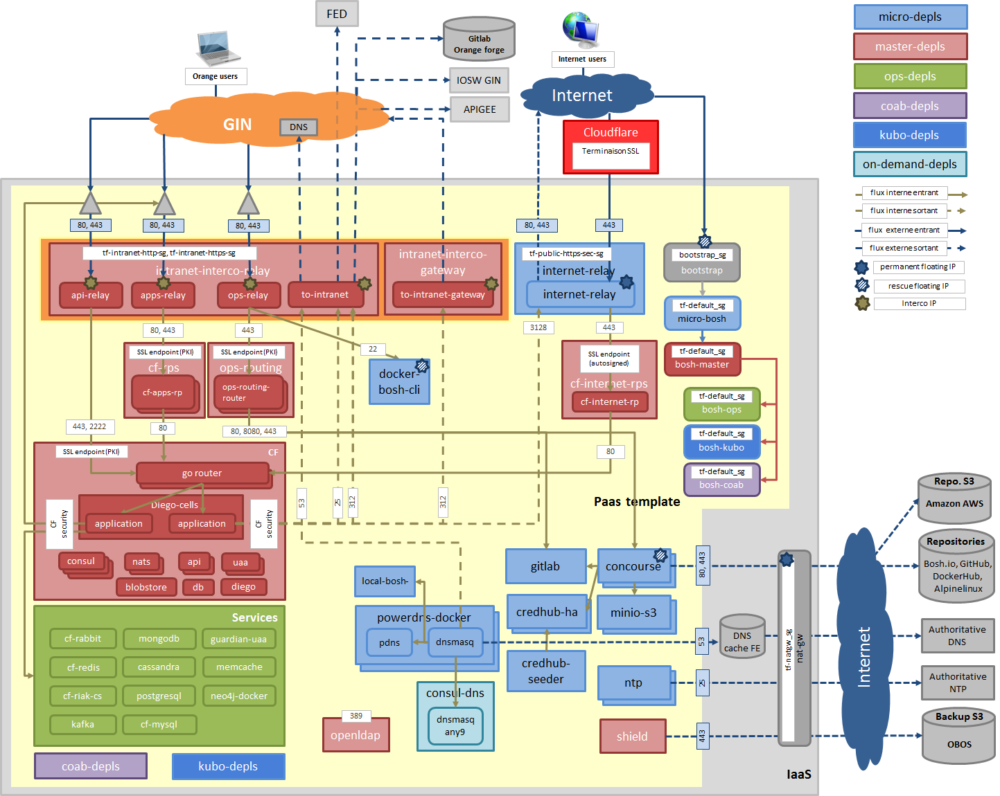

# Purpose

The solution purpose is to provide a complete package for Cloud Foundry deployment, including monitoring, backup, operators centralized logs, continuous delivery automation and a large set of OSB-API compliant services.

The solution comes "battery included", but the runner can choose to unplug some features and use "external resources" instead.

  
## Outbound access prerequisites
* Internal or proxyfied access to intranet resources:
	* Gitlab Orange Forge

* External or proxyfied access (http and https) to internet resources:
	* Github (https://github.com/)
	* Github user content (https://raw.githubusercontent.com/)
	* Bosh IO (https://bosh.io/)
	* Amazon S3 (https://s3.amazonaws.com/, https://s3-eu-west-1.amazonaws.com/)
	* OBOS S3 (https://storage.orange.com/)
	* Dockerhub (https://hub.docker.com/)
	* Image Docker Alpine for Db-dumper (http://dl-cdn.alpinelinux.org/)
	* Elpaaso-sandbox (https://bintray.com/, https://oss.jfrog.org/)

* Other internet resources (documentation, support):
	* Pivotal documentation (http://docs.run.pivotal.io/)
	* Cloud Foundry support (http://support.cloudfoundry.com)
	* Pivotal support (http://support.run.pivotal.io/)
	* Influxdb documentation (https://docs.influxdata.com/)
	* Any9 support (http://support.anynines.com)

* Outbound Internet and Intranet **DNS** access (port 53)
* Outbound Internet **NTP** access on 0.pool.ntp.org and 1.pool.ntp.org (port 123)
* Outbound **SMTP** (port 25)

## Inbound access prerequisites
* Inbound hardware load balancer appliance (e.g F5 BigIP) is supported, but not required

### Intranet inbound
* 4 Intranet inbound ip (floating ips or reserved interco ips, e.g GIN):
	* Applications flows
	* Api (Cloud foundry cli) flows
	* Runners operators flows (bosh cli operators vm and ops web UI)
	* Service operators flows (bosh cli service vm and service specific web UI)
* 4 Intranet wildcard DNS domain, with valid certificates (Orange PKI)
* Ports **80**, **8080** and **443** need to be open on intranet inbound ip

### Internet inbound
* 1 Internet inbound ip (floating ip)
* 1 Internet wildcard DNS domain, with valid certificate
* Ports **443** need to be open on internet inbound ip

## Outbound access prerequisites
* 1 Intranet outbound ip (floating ips or reserved interco ips, e.g GIN)

# Built in features
## Integration features
* 4 `Bosh directors` for deployment and day 2 management
* `Concourse` for continuous delivery
* `Credhub` secrets / password manager (act as a configuration server)
* `Credhub-seeder` for initial credhub feeding with credentials
* `bosh-cli` private jumpbox vm for platform operators ssh access

## Infrastructure features (private components for reducing dependency)
* `Power DNS`
* `LDAP`
* `NTP` relays
* `Gitlab` (PaaS template repository)
* `Minio S3` storage (bosh deployments)
* `Sonatype nexus` repository artifact manager (docker registry / proxy)

## Admin/OPS features
* `Cloudfoundry` - diego
* `Shield` backup scheduler
* `Admin UI`/`Stratos UI` - Cloud Foundry operators management console
* `ELK logsearch deployment for operators`
* `Prometheus grafana and alerting` for platform operators and associated probes
* `ELK logsearch deployment for Cloud Foundry users`, with UAA LDAP SSO and multi-tenancy
* On the fly outbound Cloud Foundry security group configuration
* Smoke tests for most services available in market place and Cloud Foundry users features

## Users features
* `Users portal` entry point for users (offer, tutorials, tools, documentation...)
* `Stratos UI` Cloud Foundry user management console
* `Pwm` ldap self service password manager
* `Sandbox` self-service experimental Cloud Foundry space creation

# OSB API services
## Database services
* `Mysql`
* `Cassandra`
* `Mongodb`
* `Redis`

## Other services
* `Rabbitmq` (message broker)
* `Memcache` (application cache)
* `Guardian UAA SAML` (SSO with Guardian)
* `Http proxy to Intranet`
* `Http proxy to Internet`
* `SMTP` (access to mail, e.g FED)
* `Db-dumper` (a self service database backup solution for Cloud Foundry users)

## Commercial services
### Any9
Provides several services (commercial annual subscription required) on per instance dedicated vms:
* `Postgresql`
* `Elasticsearch`
* `ELK` (Elasticsearch, Logstash, and Kibana)
* `Redis`

### SaaS
* `Newrelic` (application performance management)

# Main Continuous Delivery mechanisms
* Approach is declarative. The concourse automation relies on Bosh and Terraform declarations to apply and align the effective assets (vms / networks/ security groups ...) with the expected state
* Day 2 operations are all based on concourse pipelines. Expected state is read from git by concourse, which triggers bosh and terraform deployments.
* We try to collect most best practices from the opensource community and Orange Cloudfoundy deployments. When available, we include best practices templates (as git submodule, e.g Cloud Foundry-deployment, bosh-deployment, ...)
* We expect runner to align frequently, and to give back best practices and issues, to continuously improve the solution.
